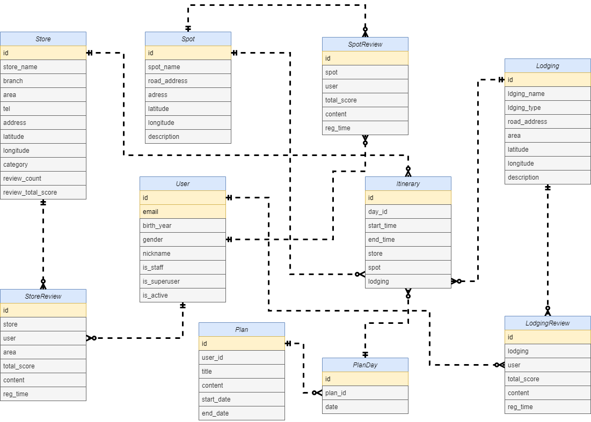

#  YUMMY 명세서

## 🤔목적

* 국내 맛집 여행 계획 플래너 서비스 재공
* 대분류(광역시/시/군)별 일정 서비스 제공
* 소분류(일정)별 시간 계획 서비스 제공
* 사용자 기반 추천 음식점 정보를 계획한 관광지/숙소별 거리 기준 제공

## 💡 주요 기능

* 일정 서비스 제공
* 일정별 시간 계획 서비스 제공
* 사용자 기반 추천 맛집 제공

## 📚데이터 활용

* SSAFY 음식점 데이터
* KaKao(MAP)
* 광역/지방 자치회 센터(시청, 군청) 데이터
* 공공API( 전국민박/펜션업소표준데이터 )
* 공공API( 전국관광지정보표준데이터 )

## 🤝 팀 소개

**삼성 청년 S/W 아카데미(SSAFY) 2기 대전 2반 공통 프로젝트 7팀**

* 김성훈 : Project Manager, Front-End, 팀장
* 김홍주 : DataBase Administrator, Back-End
* 김인성 : Full-Stack, Design
* 서현택 : Back-End, Server/API

## 📆 프로젝트 일정

* Sub PJT I    (2020.03.23 ~ 2020.03.27)
  * 데이터셋 분석 및 시각화(03.23 ~ 03.27)
* Sub PJT II   (2020.03.30 ~ 2020.04.10)
  * 1주차( 03.30 ~ 04.03)
    * 주제 선정 및 기획(03.30 ~ 03.31)
    * 설계 및 개발환경 구성(03.01)
    * 기본 기능 구현(모델링, Auth, 기본 CRUD)
  * 2주차( 04.06 ~ 04.10 )
    * 주제 구체화(04.06 ~ 04.07)
    * 스키마 설정(04.08 ~ )
    * 세부 서비스 구현(04.08 ~ )
    * 빅데이터 서비스 구현(04.08 ~ )

## 상세 명세서

* [Sub PJT I](./)
* [Sub PJT II](./Specification/Sub PJT II.md)
* [Sub PJT III](./)

## ERD

